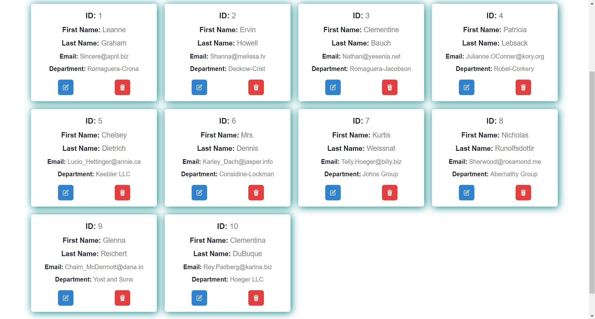
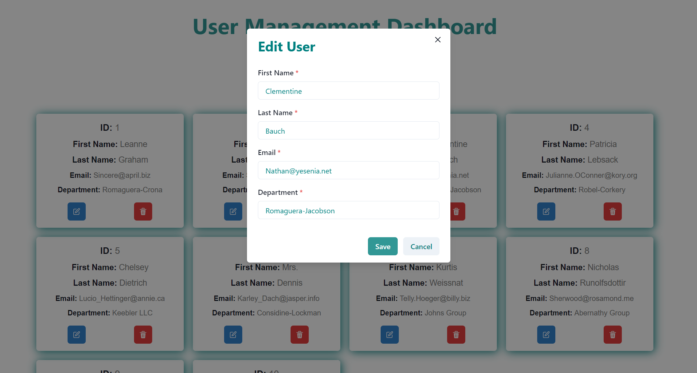

# Tachnique

## Introduction
User Managament Dashboard is a webpage in which all the users with their id, name, email and website are being displayed in the form of cards. One can manupulate the data i.e perform CRUD operation onto the website.  

## Project Type

Frontend 

## Deplolyed App

[Click here to visit website](https://user-rho-eight.vercel.app/)

## Directory Structure

user/
├── src/
├──├── assets/
├──├── components/
├──├──├── UserList.jsx
├──├──├── UserListItem.jsx
├──├──├── UserModal.jsx
├──├── utils/
├──├──├── api.js
├──├── app.js
├──├── index.js
├── .gitignore
├── package-lock.json
├── package.json
├── README.md

## Video Walkthrough of the project

[Click here to open the video](https://drive.google.com/file/d/15Be3c8RmQCd9ftz6CxcLpzIF1W2LDzgg/view?usp=sharing)

## Features
List out the key features of your application.

- New user can be added.
- Every user is editable.
- One can delete any user.
- Pagination is being implemented with infinite scrolling feature.

## design decisions or assumptions
List your design desissions & assumptions

## Installation & Getting started
Detailed instructions on how to install, configure, and get the project running. 

```bash
npm install 
```

```bash
npm start
```

## Scrrenshots








## APIs Used

https://jsonplaceholder.typicode.com/

## API Endpoints

"/users" endpoint is being used for performing CRUD opreration.

## Technology Stack
List and provide a brief overview of the technologies used in the project.

- React.js
- Chakra UI